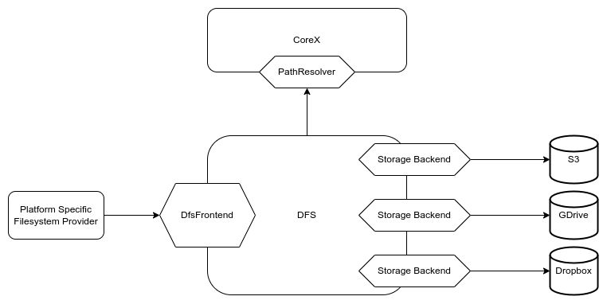
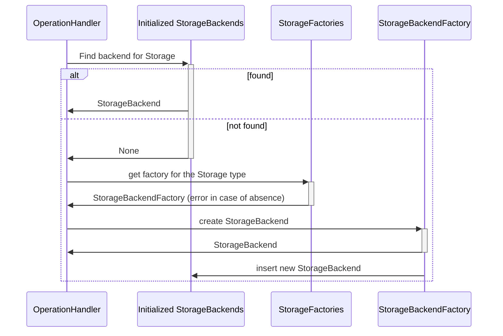

# DFS - Data and FileSystem provider

The DFS is a Wildland module responsible for exposing the actual forest containers and their data to the user.
In a typical implementation, this is expected to be done via a Filesystem-like UI, such as a mountable
or synchronizable Filesystems on desktop platforms.

This module is also responsible for data transfer from/to actual remote storage backends on which the
container data are kept (using protocols such as S3, SFTP, Dropbox API, etc).

The D/FS module can be considered a client of the CoreX module. It relies on CoreX to obtain two kinds of information:

- Where each containers data is kept (i.e. storage backend access credentials and endpoints),
- How does each of the container data map onto the user’s namespace, i.e. under which path within the forest should they be exposed to the user.

- [`DfsFrontend` description](https://docs.wildland.dev/docs/wildland/lld/doc/wildland_corex/dfs/interface/trait.DfsFrontend.html)
- [`PathResolver` description](https://docs.wildland.dev/docs/wildland/lld/doc/wildland_corex/container_manager/trait.PathResolver.html)
- [`StorageBackend` API description](https://docs.wildland.dev/docs/wildland/lld/doc/wildland_dfs/storage_backends/trait.StorageBackend.html)

## DFS Initialization

At startup, DFS module requires two things:

- Reference to object implementing `PathResolver` trait
- Collection of `StorageBackendFactory` for every supported `StorageBackend` type.

## Encryption

Data encryption is not implemented yet. However, there are two structures in this crate implementing `DfsFrontend` interface:
`UnencryptedDfs` and `EncryptedDfs`. The latter encapsulates the former. Right now `EncryptedDfs` does nothing except delegating
methods to `UnencryptedDfs`, so using `EncryptedDfs` has the same result as using `UnencryptedDfs` for now.

## DFS State

### StorageBackends

DFS keeps `StorageBackend` for every container's Storage (but it is lazy-initialized, after first use).
`StorageBackend`s of the same type (pointing to the same service, like e.g. S3) contain container-specific data,
but at the same time, they may share some structures, e.g. HTTP client etc.
What is shared between `StorageBackend`s of the same type depends on its `StorageBackendFactory` (used for creating `StorageBackend` instances).

The below diagram represents a process of getting a `StorageBackend` for given `Storage` (one Container may have multiple Storages)
during some operation, like e.g. `remove_file`.

Note, that `StorageBackendFactory` collection is initialized at the beginning of the program - there is no
way to add supported type of backend during the execution.

### Opened files descriptors

DFS keeps track of opened files. [Opened file descriptor](https://docs.wildland.dev/docs/wildland/lld/doc/wildland_dfs/storage_backends/trait.OpenedFileDescriptor.html) contains state of opened file and definition of how it is stored, therefore
it is backend specific, cause file can be stored in different ways (e.g. partitioned depending
on the backend's type) and e.g. seek operation may be implemented differently.

Opened file descriptors are inserted into DFS state while opening and removed while closing a file.

