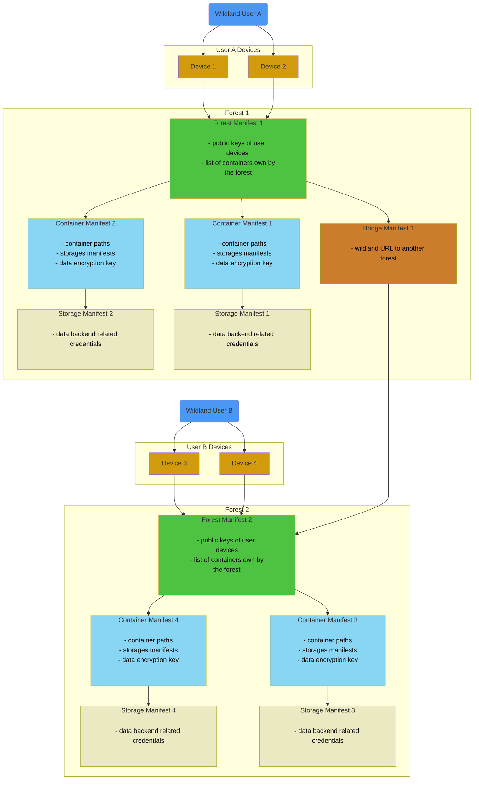

# Catlib

## Definition
Catlib (also referred to as catalog backend) represents a decentralized database that serves as synchronization endpoint for multiple devices. The goal of the component is to keep the Wildland Core's data in sync among devices using the same containers, forests, storages and bridges.

## Catlib Storage
Catlib implements CoreX interfaces for the objects for the following objects:
* `ForestManifest`
* `ContainerManifest`
* `StorageManifest`
* `BridgeManifest`
* `CatlibService`

The goal of Catlib is to orginise the data structures in a form that can be used in some underlying database engine. Currently used database is `redis`.

## Catlib in relate to other components
Catlib instance is created in Cargolib component and is immediately passed to CoreX (it's not used by Cargolib itself). CoreX stores it and uses it to synchronize the data related to objects listed above. The type of the database used in Catlib is transparent for CoreX.

## Manifests

## Integrity of manifests
The owner of the forest (that implies being owner of the all manifests belonging to the Forest entity in the network) is responsible and authorized to provide integrity of the forest's manifests. It means that the manifests can be changed only by the owner and should be signed with his/her private key. Other users may gain the READ-ONLY access to the data storage of the manifests and should be able to verify that the given manifests were modified by the owner.

 * **Open question:** What instance should play the role of the Trusted 3rd Party?

## Off-line mode and conflicts from Catlib perspective
Onboarded user should be able to read the last data stored in Catlib cache on the device that is off-line. It should also be possible to modify the local Catlib state off-line (for instance to create a new container, modify paths etc.). If a Catlib's state conflict occurs after going online, user should be able to decide which version should be considered the current one (local state of containers or the already uploaded one).

Conflict in Catlib state may occur only in a situation where a user uses at least two devices:
 * Two devices provides changes to the same manifest at the same time
 * One of the device goes off-line and user makes some changes on it without syncing for some time. In the meantime the same user modifies state on some other device. After goin

 * **Open question:** Is there any better conflict-resolution strategy for Catlib state?

## Manifests encryption
Currently (3rd of Feb 2023) the data is **not encrypted** in Catlib. Although the plan for this component is to encrypt the data transparently for the Catlib user (providing the user dencryption key required).

It's not always required to keep all the manifests encrypted. Though when encryption mode is enabled, only the owner of the forest should be able to decrypt the _Forest Manifest_. Rest of the manifests should be encrypted with different keys. This is important for the containers sharing concept. Example:
 * Three users: _UserA_, _UserB_, _UserC_,
 * _UserA_ is the owner of the _Forest_ that contains 3 containers: _C1_, _C2_, _C3_,
 * _UserA_ lets _UserB_ to decrypt _C2_ manifest, but keeps _C1_ and _C3_ private.
 * _UserA_ lets _UserC_ to decrypt _C3_ manifest, but keeps _C1_ and _C2_ private.

In order to achieve such a goal, each container manifest and related to the given container manifests should be encrypted with different keys.

 * **Open question:** What type of encryption method to use?
 * **Open question:** Where the encryption keys should be stored?
