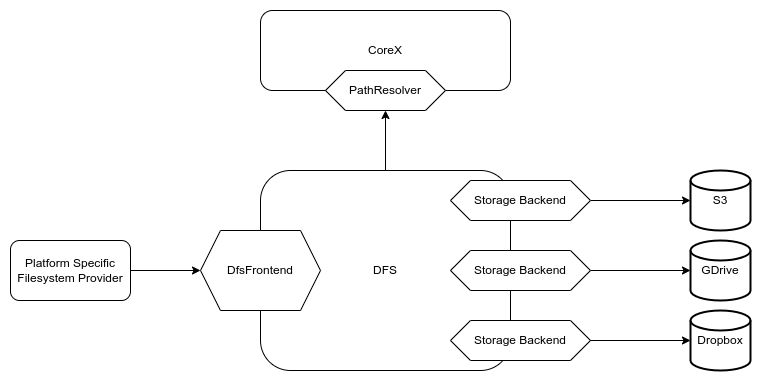

# DFS - Data and FileSystem provider

The DFS is a Wildland module responsible for exposing the actual forest containers and their data to the user.
In a typical implementation, this is expected to be done via a Filesystem-like UI, such as a mountable
or synchronizable Filesystems on desktop platforms.

This module is also responsible for data transfer from/to actual remote storage backends on which the
container data are kept (using protocols such as S3, SFTP, Dropbox API, etc).

The D/FS module can be considered a client of the CoreX module. It relies on CoreX to obtain two kinds of information:

- Where each containers data is kept (i.e. storage backend access credentials and endpoints),
- How does each of the container data map onto the user’s namespace, i.e. under which path within the forest should they be exposed to the user.

- [`DfsFrontend` description](https://docs.wildland.dev/docs/wildland/lld/doc/wildland_corex/dfs/interface/trait.DfsFrontend.html)
- [`PathResolver` description](https://docs.wildland.dev/docs/wildland/lld/doc/wildland_corex/container_manager/trait.PathResolver.html)
- [`StorageBackend` API description](https://docs.wildland.dev/docs/wildland/lld/doc/wildland_dfs/storage_backends/trait.StorageBackend.html)