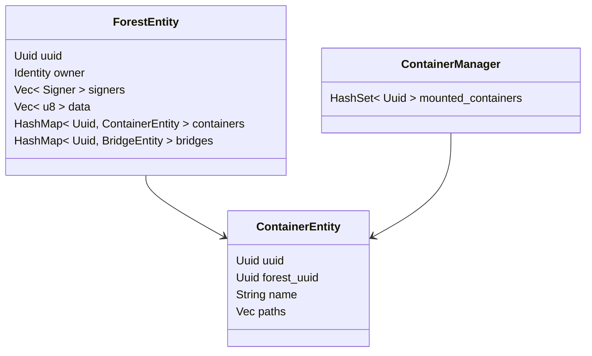
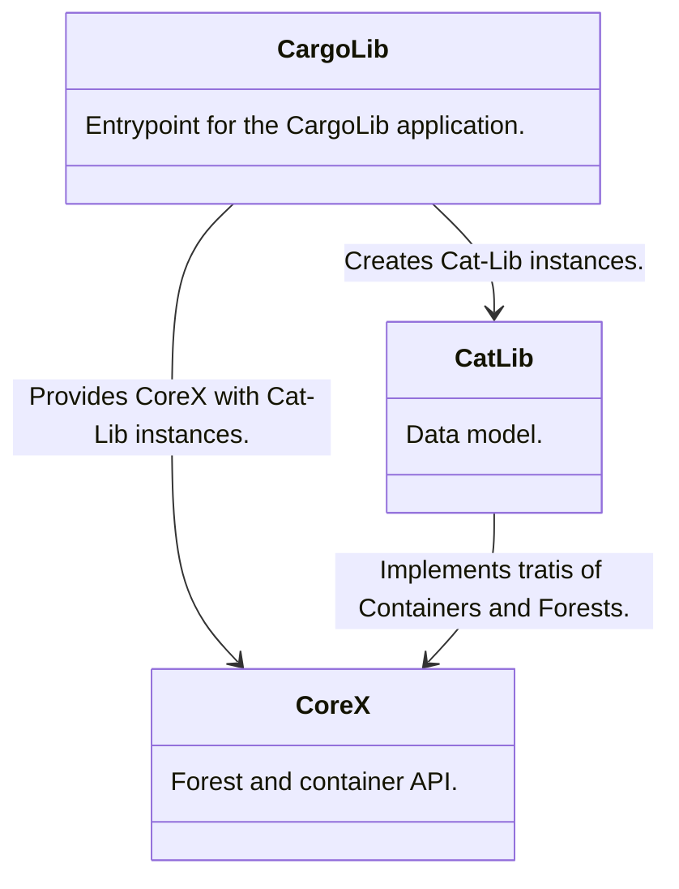

# Forests and Containers API
This document describes Forests and Containers concepts in terms of software design and API.


## Design
Model diagrams and flow charts related to Containers and Forests from the Wildland-Core perspective.


### Forest and container model in Wildland Core
The following model should be treated as a logical representation of the Container and Forest in the Wildland Core. It is not an exact representation of the data model used in any database. This model can be optimised per the database type to achieve the best performance and security.




### Example Rust structure for Forest data model in CatLib
```rust
pub struct ForestEntity {
    /// Unique at CatLib application level.
    /// 
    uuid: Uuid,

    /// There's only one owner (one public key per forest).
    /// 
    owner: Identity,

    /// For multi-device purpose (and optionally for the forest sharing mechanism).
    /// Each device has to sign the manifest.
    /// 
    signers: Vec<Signer>,

    /// Arbitrary CatLib-indepenend data. For instance Storage backends (serialized to json) etc.
    /// 
    data: Vec<u8>,

    /// Collection of containers that builds the forest.
    /// 
    containers: HashMap<Uuid, ContainerEntity>,

    /// Collection of bridges that links the forest to other forests.
    /// Bridge works as a link between forests - instead of StorageBackend
    /// contains some sort of a link to another container.
    /// 
    bridges: HashMap<Uuid, BridgeEntity>,
}

/// `ForestEntity` from CatLib should conform to trait `ForestManifest` from CoreX.
/// 
impl ForestManifest for ForestEntity { 
    // ...
}
```


### Example Rust structure for Container data model in CatLib
```rust
pub struct ContainerEntity { 
    /// Container unique UUID.
    /// 
    uuid: Uuid,

    /// Uuid (Each container has exactly one forest and one forest has many containers).
    /// 
    forest_uuid: Uuid,
    
    /// User defined container name.
    /// 
    name: String,

    /// Container claims paths within the given forest. Given directory in a
    /// file tree consists of files from different mounted containers.
    /// 
    paths: Vec<ContainerPath>
}

/// `ContainerEntity` from CatLib should conform to trait `ContainerManifest` from CoreX.
/// 
impl ContainerManifest for ContainerEntity { 
    // ...
}
```


### Example Rust structure for Container Management data model in CoreX
```rust
/// This structure preserve local state of the containers (application-wise).
/// 
pub struct ContainersState {
    /// Collection of containers locally mounted in the File Tree.
    /// 
    mounted_containers: HashSet<Uuid>,
}

impl ContainersManager for ContainersState {
    // ...
}
```


### Crates dependencies



## CoreX Forest API.
It is recommended that `ForestManifest` trait implementation should synchronize with the database on every method call in order to keep the state up-to-date.

** TODO (tkulik) WILX-352: Add description instead of raw rust traits. **

## CoreX Container API for Cat-Lib implementation.
It is recommended that `ContainerManifest` trait implementation should synchronize with the database on every method call in order to keep the state up-to-date.

** TODO (tkulik) WILX-352: Add description instead of raw rust traits. **


## CoreX Container API for mount procedure.
```rust
/// This trait should be implemented in CoreX or other special crate that is responsible
/// for mounting the container within the File Tree. Container Manager is an API for the
/// object representing the local (device) state of the forest and containers. It keeps
/// the information about containers mounted locally.
/// 
pub trait ContainersManager {
    /// Mount creates locally the representation of the container (files/directories structures).
    /// The procedure updates only the file tree, it doesn't sync the container data itself.
    ///
    /// This procedure is considered to work in background.
    /// 
    fn mount(&mut self, container: &dyn ContainerManifest) -> Result<(), ContainerManagerError>;

    /// The operation oposit to mount. It removes the container from the file tree representation.
    /// 
    /// This procedure is considered to work in background.
    /// 
    fn unmount(&mut self, container: &dyn ContainerManifest) -> Result<(), ContainerManagerError>;

    /// Checks whether the given container was mounted in the file tree.
    /// 
    fn is_mounted(&self, container: &dyn ContainerManifest) -> bool;
}
```


## CargoLib API
`ContainerManager`, `ForestManifest` and `ContainerManifest` are provided by `CargoUser` object. This API requires rusty-bind to provide users with `Box` type support.

```rust
mod ffi {
    //
    // ContainerManager
    //
    fn mount(self: &mut ContainersManager, container: &dyn ContainerManifest) -> Result<(), ContainerMountError>;
    fn unmount(self: &mut ContainersManager, container: &dyn ContainerManifest) -> Result<(), ContainerUnmountError>;
    fn is_mounted(self: &mut ContainersManager, container: &dyn ContainerManifest) -> bool;

    //
    // ForestManifest
    //
    fn is_deleted(self: &Arc<Mutex<ForestManifest>>) -> bool;
    fn stringify(self: &Arc<Mutex<ForestManifest>>) -> String;
    fn delete(self: &Arc<Mutex<ForestManifest>>, catlib_service: &CatLibService) -> Result<(), CatlibError>;
    fn uuid(self: &Arc<Mutex<ForestManifest>>) -> Uuid;
    fn add_path(self: &Arc<Mutex<ForestManifest>>, path: String) -> Result<bool, CatlibError>;
    fn delete_path(self: &Arc<Mutex<ForestManifest>>, path: String) -> Result<bool, CatlibError>;
    fn get_paths(self: &Arc<Mutex<ForestManifest>>) -> Result<Vec<String>, CatlibError>;
    fn get_name(self: &Arc<Mutex<ForestManifest>>) -> String;
    fn set_name(self: &Arc<Mutex<ForestManifest>>, new_name: String) -> Result<(), ContainerError>;

    //
    // ContainerManifest
    //
    fn add_signer(self: &Arc<Mutex<ContainerManifest>>, signer: Identity) -> Result<bool, CatlibError>;
    fn del_signer(self: &Arc<Mutex<ContainerManifest>>, signer: Identity) -> Result<bool, CatlibError>;
    fn containers(self: &Arc<Mutex<ContainerManifest>>) -> Result<Vec<Box<dyn Container>>, CatlibError>;
    fn update(self: &Arc<Mutex<ContainerManifest>>, data: Vec<u8>) -> Result<&mut dyn Forest, CatlibError>;
    fn delete(self: &Arc<Mutex<ContainerManifest>>) -> Result<bool, CatlibError>;
    fn create_container(self: &Arc<Mutex<ContainerManifest>>, name: String) -> Result<Box<dyn Container>, CatlibError>;
    fn find_bridge(self: &Arc<Mutex<ContainerManifest>>, path: ContainerPath) -> Result<Box<dyn Bridge>, CatlibError>;
    fn find_containers(
        self: &Arc<Mutex<ContainerManifest>>,
        paths: Vec<ContainerPath>,
        include_subdirs: bool,
    ) -> Result<Vec<Box<dyn Container>>, CatlibError>;

}
```
