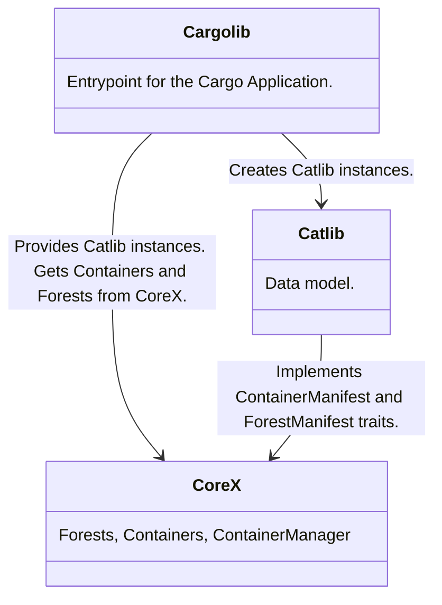
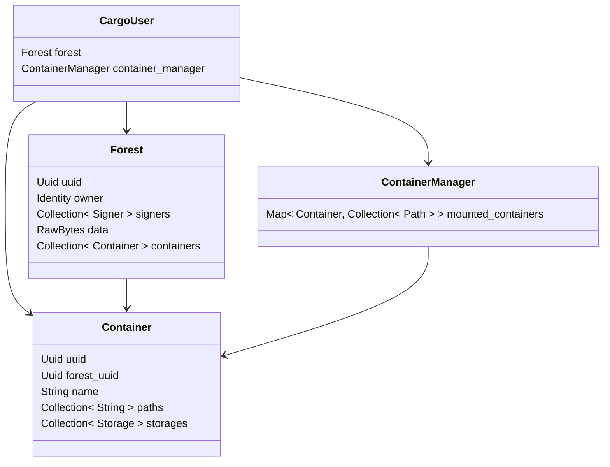

# Forests and Containers
This document describes Forests and Containers concepts in terms of software design and procedures.

## Design
Model diagrams related to Containers and Forests from the Wildland-Core perspective.

### Crates dependencies
Concepts of Container and Forest are spread along the core's crates. Those notions are used in a different context within `Cargolib`, `CoreX` and `Catlib`:

* `Catlib` is a bridge between the Wildland and different databases. 
* `CoreX` uses Catlib to store, sync and load the state of the _ForestManifests_ and _ContainerManifests_, that are shared between multiple devices. It also provides other components with actual notions of _Container_ and _Forest_. The second role of `CoreX` is to keep the local (current device) state of mounted and unmounted containers in the _ContainerManager_ instance.
* `Cargolib` uses `Corex` to provide application with more user friendly interface of _Wildland_. It plays a role of a facade for the complexity of the Core's internals and provides application with other features that are not directly related to _Containers_ and _Forests_.

### Forest and Container model in Wildland-Core
The following model should be treated as a logical representation of the Container and Forest in the Wildland Core. It is not an exact representation of the data model used in any database. This model can be optimized per each database type to achieve the best performance and security.

### Cargolib interface - CargoUser
In `Cargolib` the notion of the _Forest_ and _ContainerManager_ is hidden behind an instance of _CargoUser_. From the application point of view, this component handles the multi-device state of the user's forest and containers as well as the local state of mounted containers. Instance of this component is a result of the "User onboarding procedure". Instance of _CargoUser_ can be recreated for the already registered user after application restart.
