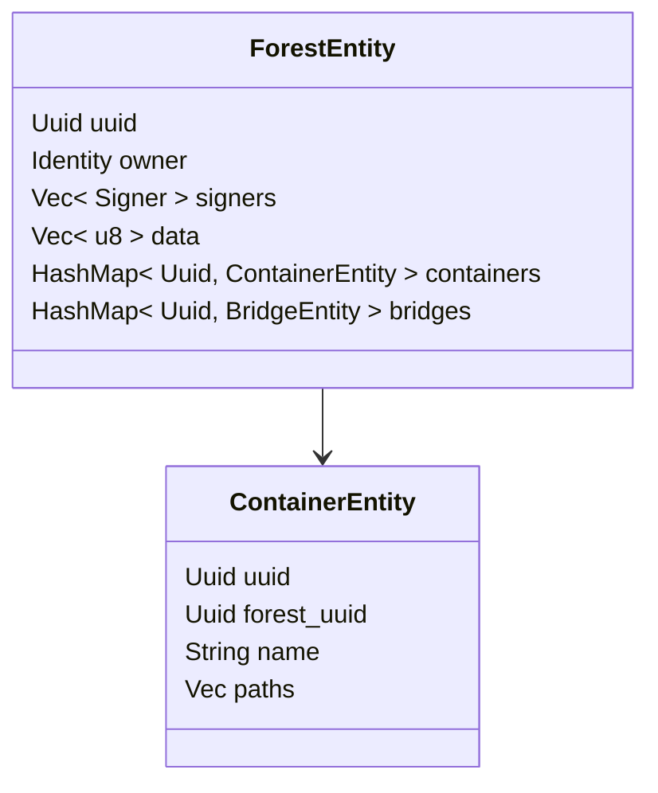

# Forests and Containers API
This document describes Forests and Containers concepts in terms of software design and API.


## Design
Model diagrams and flow charts related to Containers and Forests from the Wildland-Core perspective.


### Flow of the initial forest creation.
**TODO [WILX-328]**: Add flow chart of the Forest creation procedure.


### Forest and container model in Wildland Core.
The following model should be treated as a logical representation of the Container and Forest in the Wildland Core. It is not an exact representation of the data model used in any database. This model can be optimised per the database type to achieve the best performance and security.



Example Rust structure definitions:
```rust
pub struct ForestEntity {
    /// Unique at CatLib application level.
    /// 
    uuid: Uuid,

    /// There's only one owner (one public key per forest).
    /// 
    owner: Identity,

    /// For multi-device purpose (and optionally for the forest sharing mechanism).
    /// Each device has to sign the manifest.
    /// 
    signers: Vec<Signer>,

    /// Arbitrary CatLib-indepenend data. For instance Storage backends (serialized to json) etc.
    /// 
    data: Vec<u8>,

    /// Collection of containers that builds the forest.
    /// 
    containers: HashMap<Uuid, ContainerEntity>,

    /// Collection of bridges that links the forest to other forests.
    /// Bridge works as a link between forests - instead of StorageBackend
    /// contains some sort of a link to another container.
    /// 
    bridges: HashMap<Uuid, BridgeEntity>,
}

/// `ForestEntity` from CatLib should conform to trait `ForestManifest` from CoreX.
/// 
impl ForestManifest for ForestEntity { 
    // ...
}

pub struct ContainerEntity { 
    /// Container unique UUID.
    /// 
    uuid: Uuid,

    /// Uuid (Each container has exactly one forest and one forest has many containers).
    /// 
    forest_uuid: Uuid,
    
    /// User defined container name.
    /// 
    name: String,

    /// Container claims paths within the given forest. Given directory in a
    /// file tree consists of files from different mounted containers.
    /// 
    paths: Vec<ContainerPath>
}

/// `ContainerEntity` from CatLib should conform to trait `ContainerManifest` from CoreX.
/// 
impl ContainerManifest for ContainerEntity { 
    // ...
}
```


### Crates dependencies


## CoreX Forest API.
It is recommended that `ForestManifest` trait implementation should synchronize with the database on every method call in order to keep the state up-to-date.

```rust
/// `ForestManifest` trait is an API providing methods needed to operate on the forest's
/// state. It should be implemented by Cat-Lib instance and should be
/// treated as a kind of a proxy layer between Wildland Core and the external
/// persistent data storage instance (for e.g. database).
/// 
pub trait ForestManifest {
    /// Add manifest Signer
    ///
    /// Returns whether the value was newly inserted. That is:
    ///
    /// - If the signer did not previously exist, `true` is returned.
    /// - If the signer already exists, `false` is returned.
    /// 
    fn add_signer(&mut self, signer: Identity) -> Result<bool, CatlibError>;

    /// Delete manifest Signer
    ///
    /// Returns whether the value was already present. That is:
    ///
    /// - If the signer did not previously exist, `false` is returned.
    /// - If the signer existed in the set, `true` is returned.
    /// 
    fn del_signer(&mut self, signer: Identity) -> Result<bool, CatlibError>;

    /// Return list of Forest Containers
    fn containers(&self) -> Result<Vec<Box<dyn Container>>, CatlibError>;

    /// Set Forest arbitrary data
    /// 
    fn update(&mut self, data: Vec<u8>) -> Result<&mut dyn Forest, CatlibError>;

    /// Delete Forest
    ///
    /// **WARN: The underlying objects are not removed recursively**
    /// 
    fn delete(&mut self) -> Result<bool, CatlibError>;

    /// Create an empty container, bound to the Forest.
    ///
    /// To set container paths, use [`Container::add_path`]
    /// 
    fn create_container(&self, name: String) -> Result<Box<dyn Container>, CatlibError>;

    /// Create a Bridge object with arbitrary link data to another Forest.
    ///
    /// The aforementioned link data will be defined by the D/FS module.
    /// 
    fn create_bridge(
        &self,
        path: ContainerPath,
        link_data: Vec<u8>,
    ) -> Result<Box<dyn Bridge>, CatlibError>;

    /// Return bridge that matches the given [`ContainerPath`].
    fn find_bridge(&self, path: ContainerPath) -> Result<Box<dyn Bridge>, CatlibError>;

    /// Retrieve Containers that match given [`ContainerPath`]s.
    ///
    /// If `include_subdirs` is `true`, then the [`ContainerPath`]s are treated as Path prefixes
    /// and not absolute paths.
    /// 
    fn find_containers(
        &self,
        paths: Vec<ContainerPath>,
        include_subdirs: bool,
    ) -> Result<Vec<Box<dyn Container>>, CatlibError>;
}
```


## CoreX Container API for Cat-Lib implementation.
It is recommended that `ContainerManifest` trait implementation should synchronize with the database on every method call in order to keep the state up-to-date.

```rust
/// `ContainerManifest` trait is an API providing methods needed to manipulate container's
/// configuration state. It should be implemented by Cat-Lib instance and should be
/// treated as a kind of a proxy layer between Wildland Core and the external
/// persistent data storage instance (for e.g. database).
/// 
pub trait ContainerManifest {
    /// Lists the storages that the given container use in order to keep the data.
    /// 
    fn get_storages(&self) -> Result<Vec<&dyn StorageBackend>, GetStoragesError>;

    /// Removes the given storage backend from the container.
    /// This operation should involve a secure way of erasing data from the storage.
    /// 
    fn delete_storage(&mut self, storage: &dyn StorageBackend) -> Result<(), DeleteStorageError>;

    /// This operation adds a given Storage Backend to the container.
    /// The procedure involves starting the data sync mechanism between the new storage
    /// and the other present storages.
    /// 
    /// Container can have multiple storages. Given container should has exact copies
    /// of the data on every storage.
    /// 
    fn add_storage(&mut self, storage: &dyn StorageBackend) -> Result<(), AddStorageError>;

    /// Checks whether the given container handle is deleted.
    /// 
    fn is_deleted(&self) -> bool;

    /// Returns a printable description of the given container.
    /// 
    fn stringify(&self) -> String;

    /// Deletes all paths that the given container contains.
    /// In result the container is considered deleted afterwards.
    /// Container should be treated as a "shared pointer" - once the
    /// last path is deleted the container should be moved to 
    /// some sort of a "trash bin".
    /// 
    fn delete(&mut self, catlib_service: &CatLibService) -> Result<(), CatlibError>;

    /// Returns the unique ID of the container.
    /// 
    fn uuid(&self) -> Uuid;

    /// Returns true if path was actually added, false otherwise.
    /// 
    fn add_path(&mut self, path: String) -> Result<bool, CatlibError>;

    /// Removes the given path. Returns true if the path was actually deleted,
    /// false if the path was not present within the container.
    /// 
    fn delete_path(&mut self, path: String) -> Result<bool, CatlibError>;

    /// Lists all the paths from the given container.
    /// 
    fn get_paths(&self) -> Result<Vec<String>, CatlibError>;

    /// User provided name of the container.
    /// 
    fn get_name(&self) -> String;

    /// Sets the user provided name for the container.
    /// This operation involves updating at least the local storage.
    /// 
    fn set_name(&mut self, new_name: String) -> Result<(), ContainerError>;
}
```

## CoreX Container API for mount procedure.
```rust
/// This trait should be implemented in CoreX or other special crate that is responsible
/// for mounting the container within the File Tree.
/// 
/// Note: the async methods can be replaced with async iterators or callback methods in the future.
/// 
pub trait ContainerMount {
    /// Mount creates locally the representation of the container (files/directories structures).
    /// The procedure updates only the file tree, it doesn't sync the container data itself.
    ///
    async fn mount(&mut self) -> Result<(), ContainerMountError>;

    /// The operation oposit to mount. It removes the container from the file tree representation.
    /// 
    async fn unmount(&mut self) -> Result<(), ContainerUnmountError>;

    /// Checks whether the given container was mounted in the file tree.
    /// 
    fn is_mounted(&self) -> bool;
}
```
