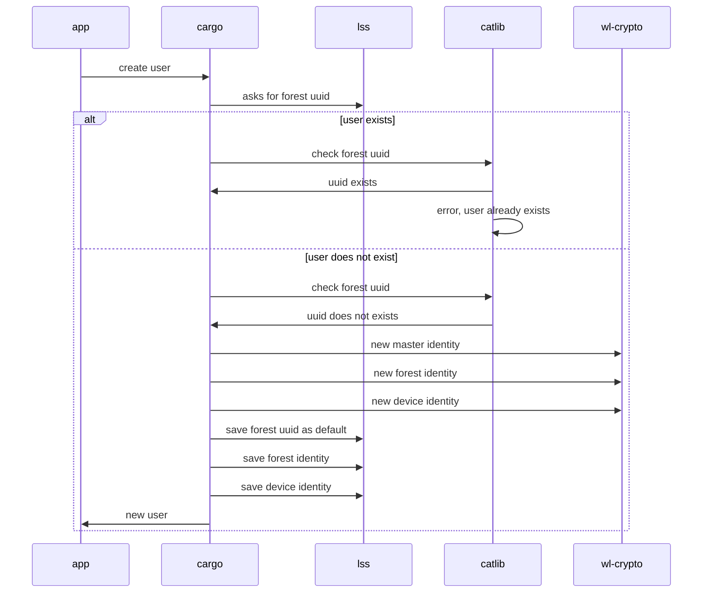

# User Creation Process

## Cargo: User Creation flow

User creation depends on multiple components, namely:

* `Cargo`
  * that facilitates high-level handling of user identities,
  * makes sure there is only one master identity and there are no collisions
* `Corex` components:
  * `LSS` - abstractions handling secure storage on specific platforms,
    stores private keys and identities
  * `wl-crypto` - handling the cryptographic operations
    creates the identities and keys required by other components
  * `catlib` - backend responsible for distributed storage, stores the public
    identities and configurations that can be shared between the devices
