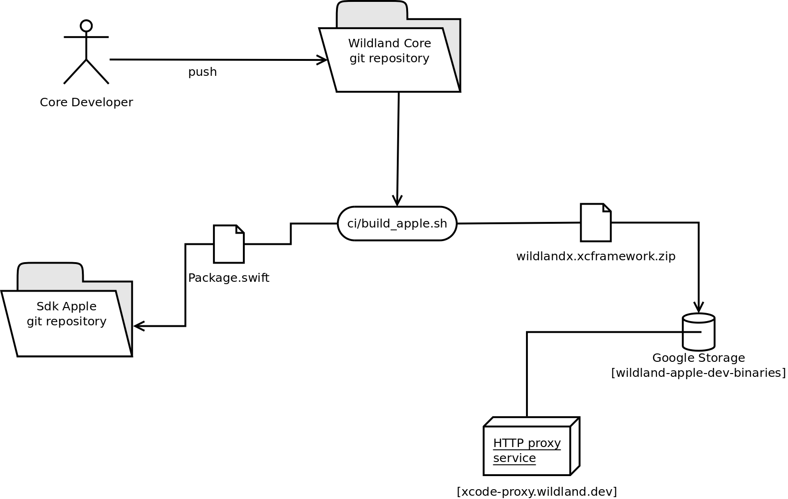
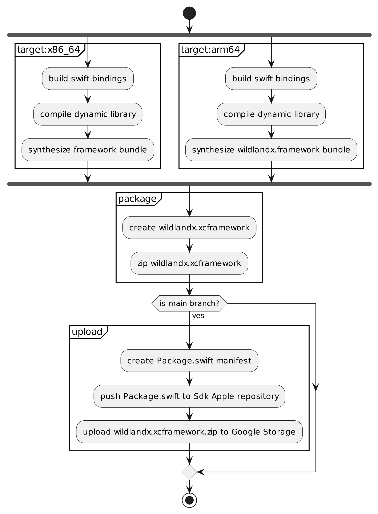

# CI support for building SDK for Apple frameworks

Core project CI delivers SDK in form of multi-architecture
framework published as [binary Swift package](https://developer.apple.com/documentation/xcode/distributing-binary-frameworks-as-swift-packages).

This document describes the setup and requirements involved.

## CI process

CI is configured to build Apple SDK according to figure below.

Every merge request triggers building the SDK and each commit to
_main_ branch triggers both building and publishing the
SDK.

Apple SDK builds are executed by CI workers tagged with `macos`
tag. See [Worker requirements](#worker-requirements) section for
detailed requirements that build machines must meet.

## Build flow

SDK build is performed by `ci/build_apple.sh` script which
implements the following flow.

Build is performed as shown on figure 2. 

## Involved infrastructure

Key elements of the involved build infrastructure are shown in
the diagram at the beginning of this document. More details on
their role is provided in this section.

### Repositories

There are two git repositories involved in the process:

- [Wildland Core](https://gitlab.com/wildland/corex/wildland-core)
  is where builds are triggered
- [Sdk Apple](https://gitlab.com/wildland/corex/sdk-apple) is a
  technical repository for storing Swift package manifests for
  SDK releases
  
When new build of SDK is uploaded, a corresponding package
manifest is generated and pushed to _Sdk Apple_ repository.

### Binary artifact hosting service

The setup uses a Google Storage service
(_wildland-apple-dev-binaries_) to host binary builds of the
SDK. The service is expected to be publicly accessible through
HTTP.

Note that Swift Package manager used as part of Apple development
environment has currently an issue that, when accessing public
HTTP sites it proactively sends HTTP basic authentication header
with empty credentials. This does not work with Google Storage,
which rejects such requests as unauthorized. To work this problem
around, a HTTP proxy (_xcode-proxy.wildland.dev_) is deployed as
part of the infrastructure. The sole task of the proxy is to
remove `Authorization` header from HTTP requests relayed to
Google Storage.

### Worker requirements

The build step needs to be executed by worker capable with
compiling artifacts for Apple targets (macOS/iOS). Additional
requirements:

- Rust compiler supporting `aarch64-apple-darwin` and
  `x86_64-apple-darwin` targets
- [Google Cloud SDK](https://cloud.google.com/sdk/)

Also, the account, from which builds are performed must be able
to push to _master_ branch of _Sdk Apple_ repository.

## Relevant configuration variables

Build script expects that `APPLE_GCS_BUCKET_UPLODAER_ACCT` secret
contains base64 encoded authentication token for Google Storage
uploads.

Other relevant variables are defined and documented in
`build_apple.sh`.

## Integrating Apple SDK into macOS project

To use Apple Wildland SDK in Xcode project one should enter
`https://gitlab.com/wildland/corex/sdk-apple.git` as Swift
package URL, use _branch_ dependency resolution rule and set
master as branch to be tracked.

## Further work

The following issues are not handled yet and need to be addressed
by future work:

1. Separate debug/release builds.
2. Version tagging.
3. Add iOS SDK target.
