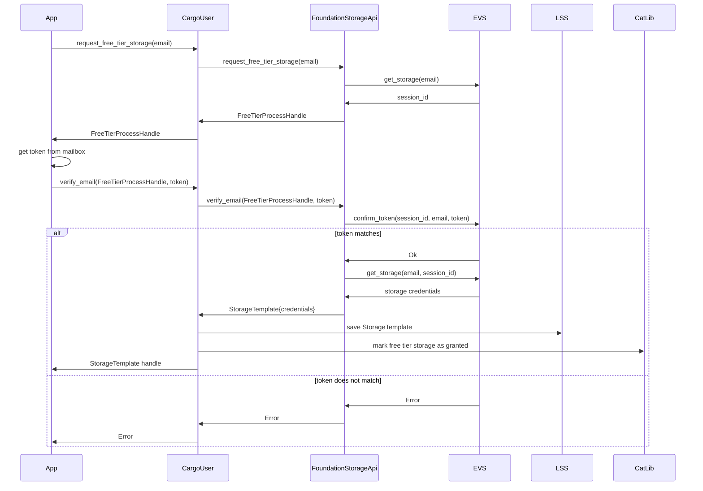

# Request free tier Foundation Storage

```mermaid
sequenceDiagram
App->>CargoUser: request_free_tier_storage(email)
CargoUser->>FoundationStorageApi: request_free_tier_storage(email)
FoundationStorageApi->>EVS: get_storage(email)
EVS->>FoundationStorageApi: session_id
FoundationStorageApi->>CargoUser: FreeTierProcessHandle
CargoUser->>App: FreeTierProcessHandle
App->>App: get token from mailbox
App->>CargoUser: verify_email(FreeTierProcessHandle, token)
CargoUser->>FoundationStorageApi: verify_email(FreeTierProcessHandle, token)
FoundationStorageApi->>EVS: confirm_token(session_id, email, token)
alt token matches
EVS->>FoundationStorageApi: Ok
FoundationStorageApi->>EVS: get_storage(email, session_id)
EVS->>FoundationStorageApi: storage credentials
FoundationStorageApi->>CargoUser: StorageTemplate{credentials}
CargoUser->>LSS: save StorageTemplate
CargoUser->>CatLib: mark free tier storage as granted
CargoUser->>App: StorageTemplate handle
else token does not match
EVS->>FoundationStorageApi: Error
FoundationStorageApi->>CargoUser: Error
CargoUser->>App: Error
end
```